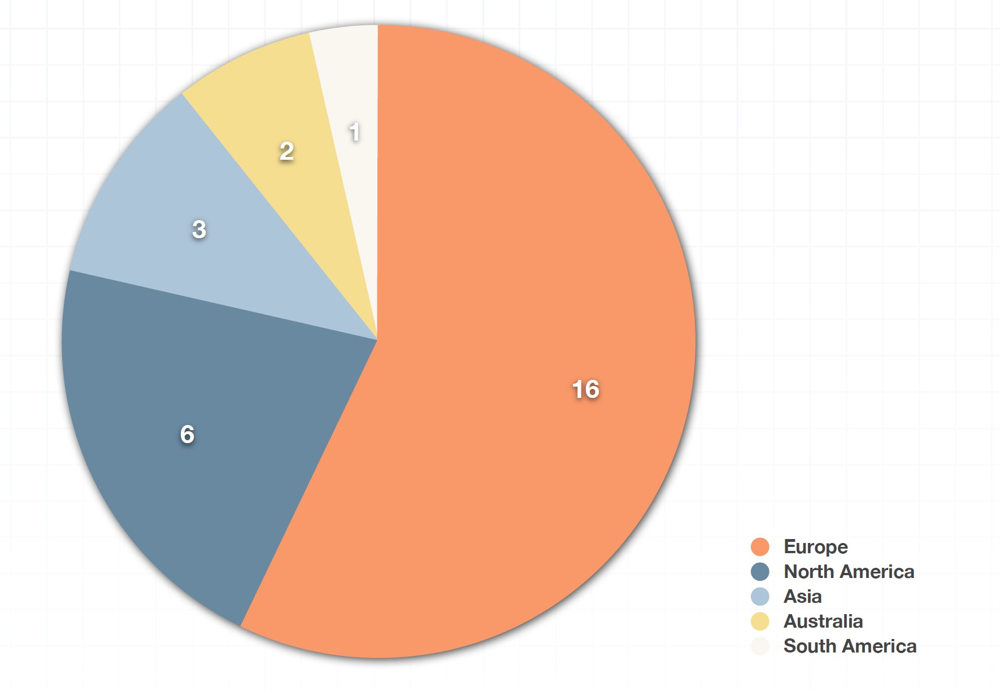
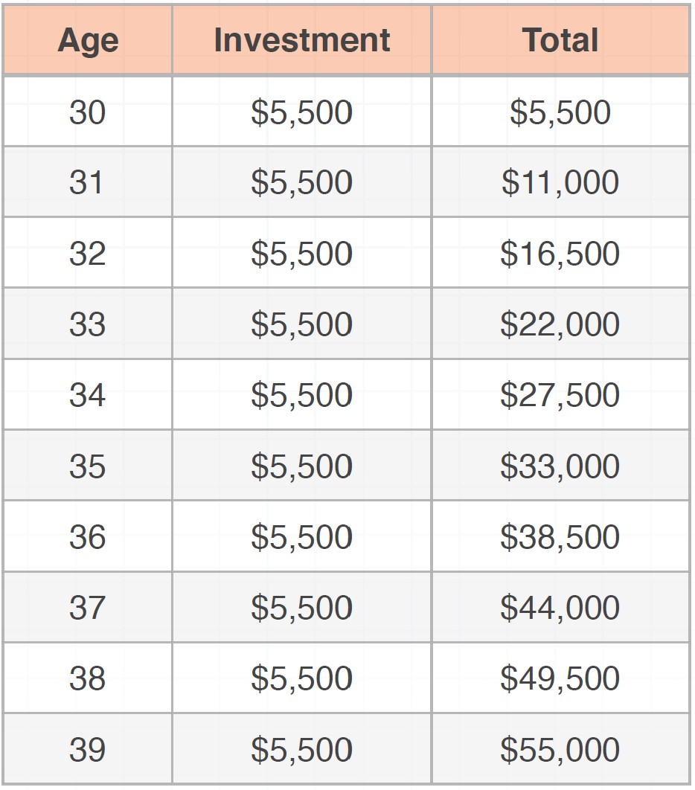
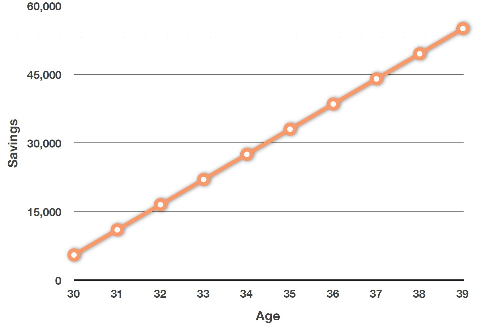

# Categorical Data Visualization

## Bar Chart and Pie Chart

#### Suitable for categorical data visualization

This type of charts is used to visualize the nominal data types \(categorical data types\) by constructing a frequency table at the beginning. Each category frequency will be presented as a single bar.

The same information could be visualized as a pie chart:

## Line Chart

#### Suitable for Time-dependent Variables \(Categorical Data Visualization\)

## Ogive Line Chart

It's a special kind of line graph. You can think of it as an accumulated line graph. it's very adequate for some types of data visualization like an accumulated investment over time.

## Dot Chart

