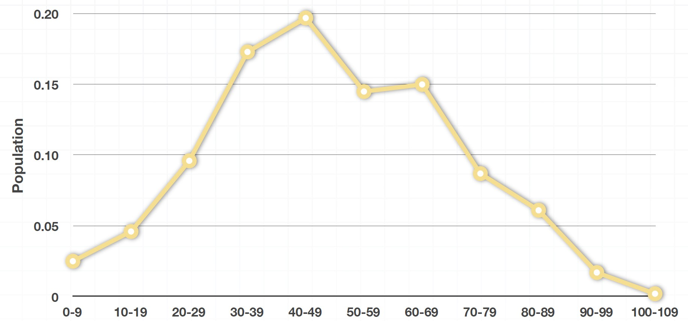
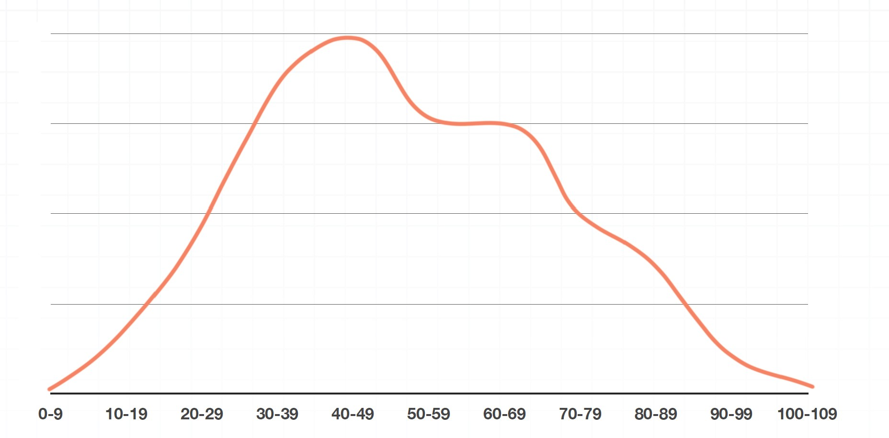

# Data Distibution

### Population

A population is the entire group of subjects that we’re interested in. The population has N subjetcs.

### Sample

A sample is just a subsection of the population. The sample has n subjects.

### Absolute Frequency Histogram

### Relative Frequency Histogram

The summation of all values would sum up to 100%

### Frequency Polygons

### Density Function

### Symmetric distributions

In symmetric distributions: mean, median and mode are at the very center of the data.

### Left-skewed distribution 

### Right-skewed distribution

Mode at the peak. Median divides area 50% to right and 50% to left. mean is shifted a little bit towards outliers.

### Outliers rules

